# A2Z IntelliBrain - Mermaid Architecture Diagrams

## System Overview Diagram

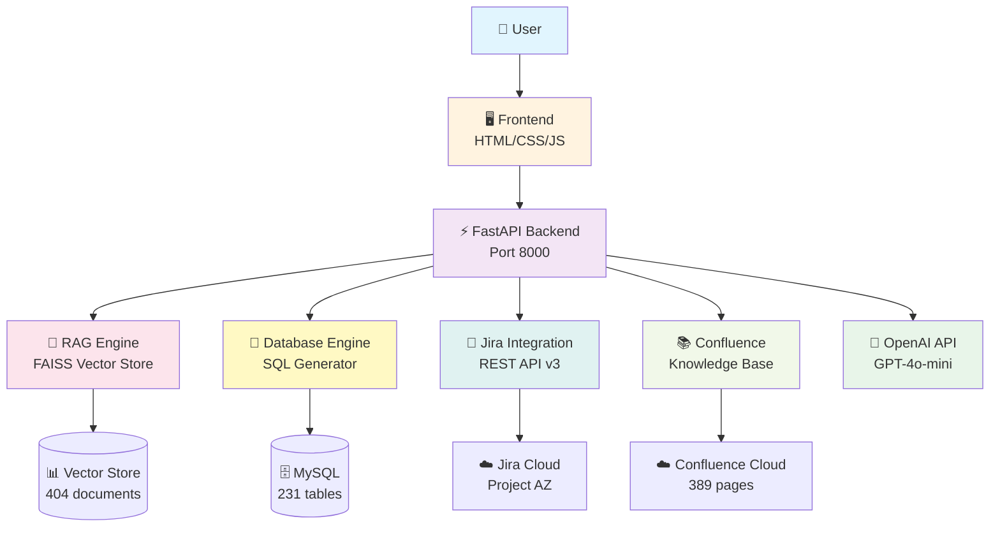

## Data Flow Diagram - Database Query

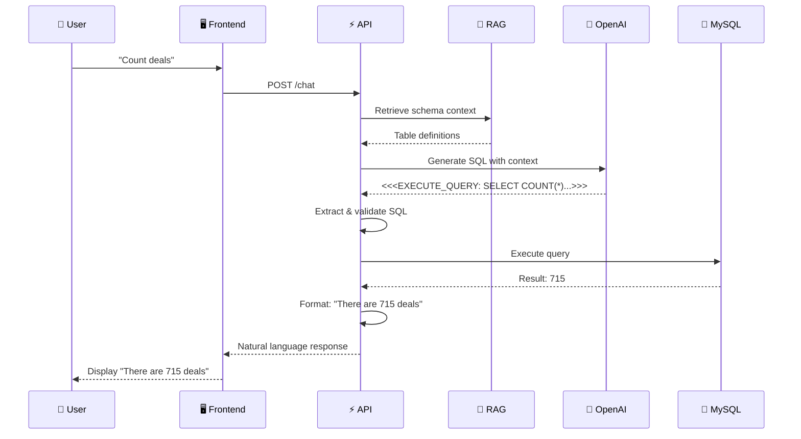

## Data Flow Diagram - Confluence Search

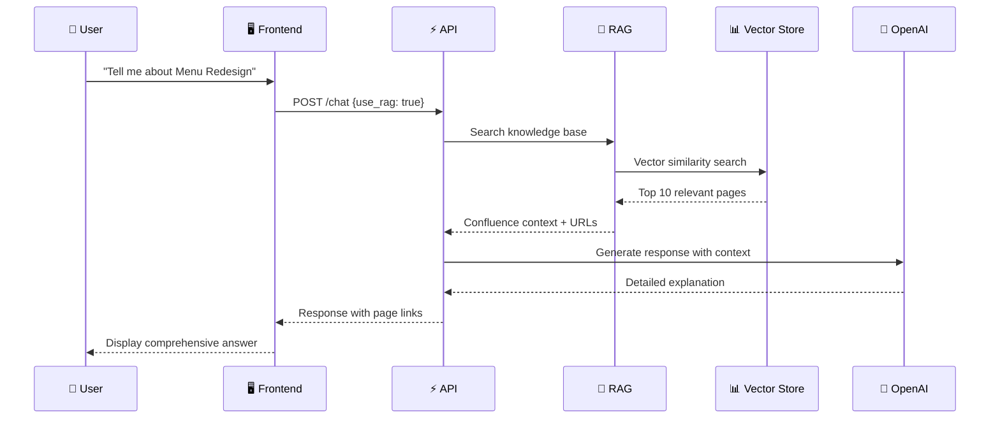

## Data Flow Diagram - Jira Integration

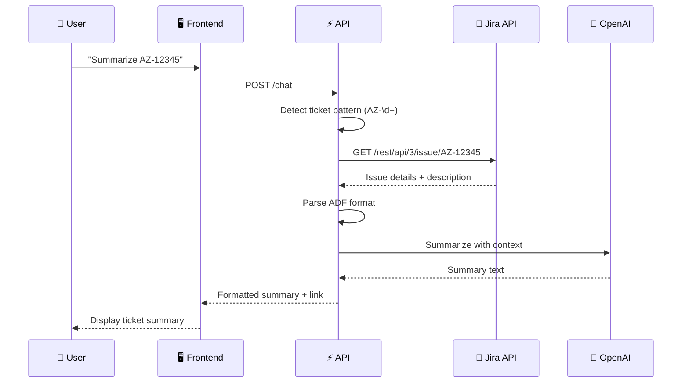

## Component Architecture

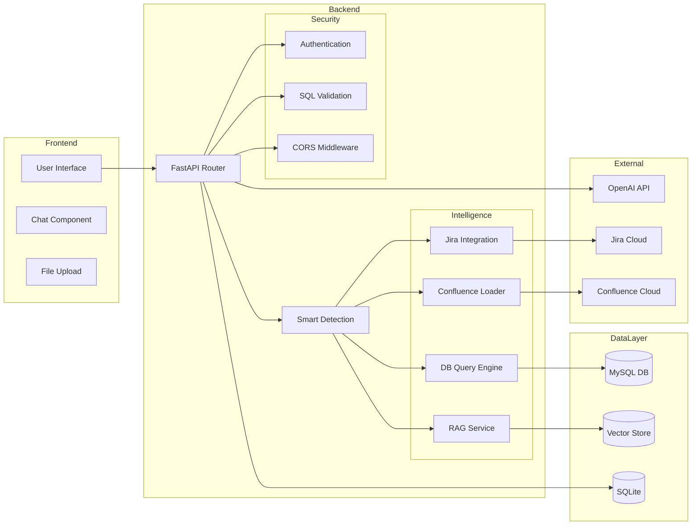

## RAG Pipeline

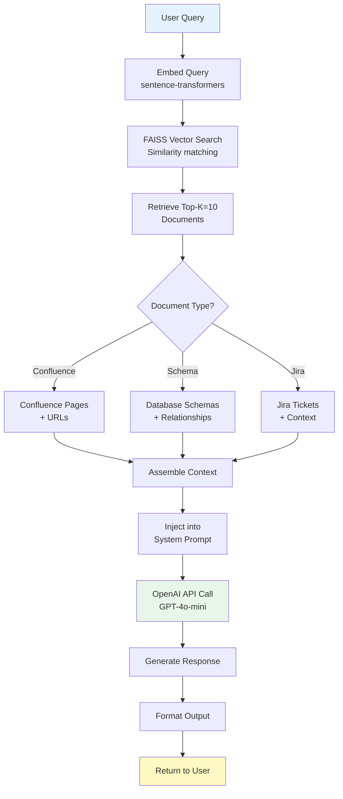

## Security Flow

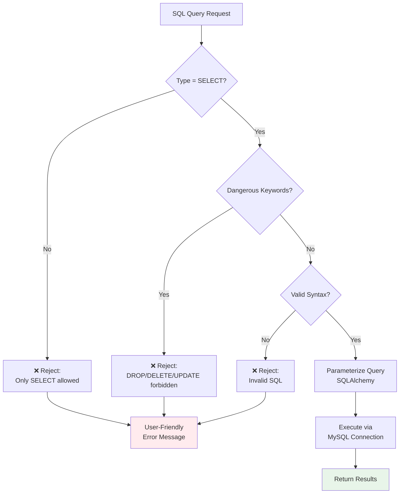

## Technology Stack

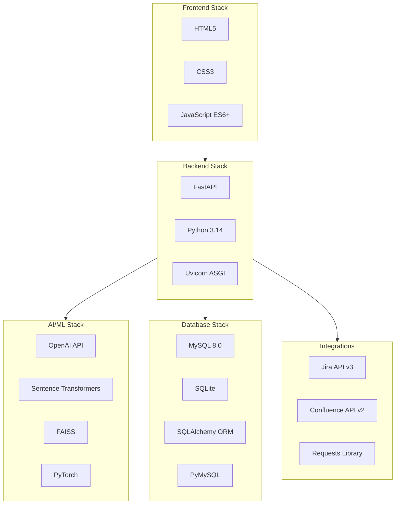

## Deployment View

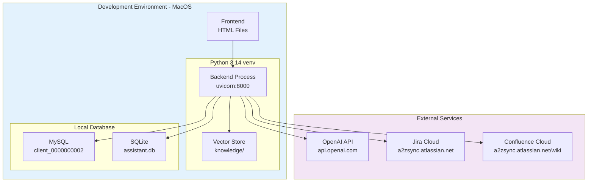

## System State Diagram

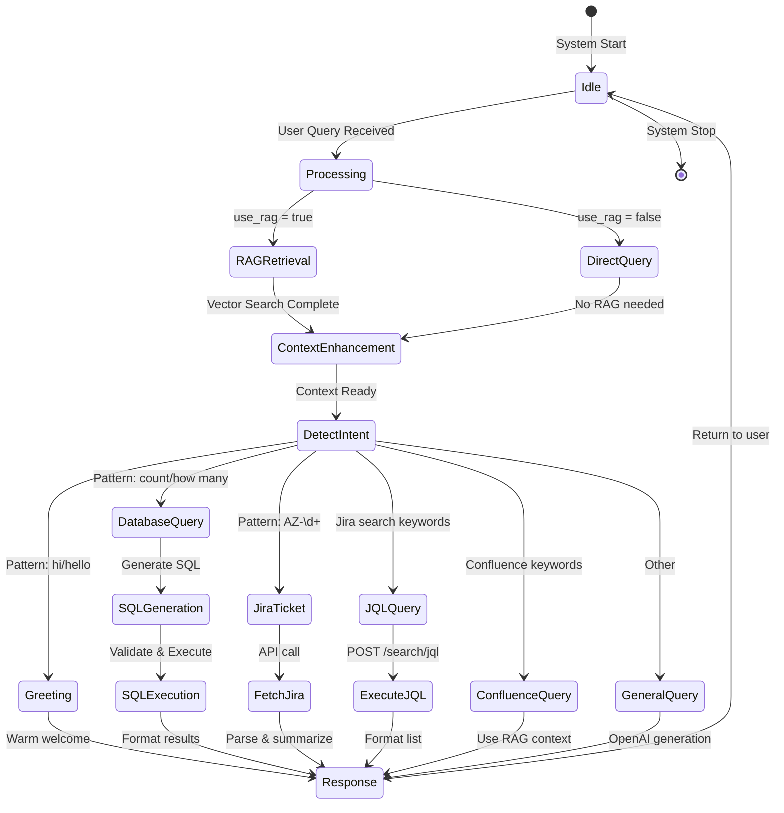

## Error Handling Flow

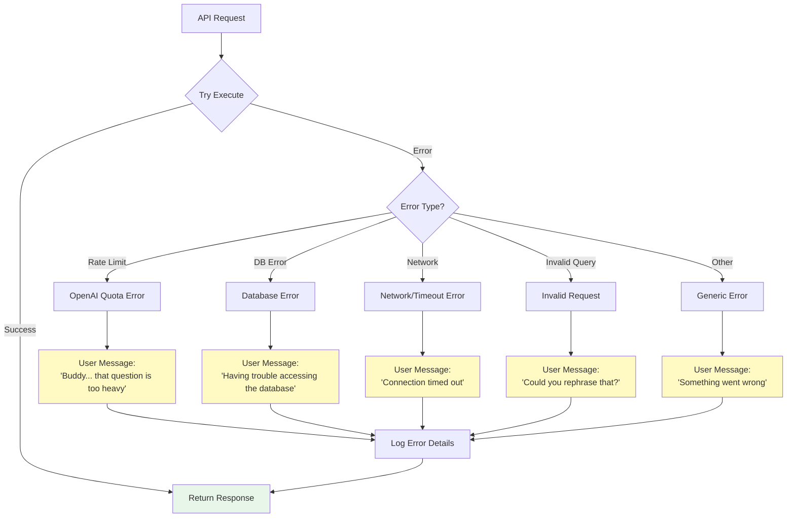

---

## How to Use These Diagrams

### For Presentations:
1. Copy the Mermaid code blocks into https://mermaid.live
2. Export as PNG/SVG for slides
3. Or use Mermaid plugins in PowerPoint/Keynote

### For Documentation:
- GitHub automatically renders Mermaid diagrams
- Confluence supports Mermaid with plugins
- Use markdown preview tools that support Mermaid

### For Hackathon:
- Use the "System Overview" for high-level explanation
- Use "Data Flow" diagrams to show query processing
- Use "Component Architecture" to show technical depth

---

*These diagrams visualize the complete A2Z IntelliBrain architecture, from user interface to data sources.*

